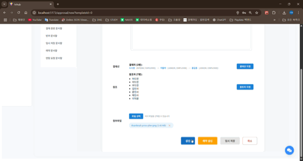

## 🧑‍💻 프로젝트 개요

- **플랫폼명**: HRHub
- **팀명**: DCT(Dreams Come True)
- **개발방식**: React 기반 Single Page Application(SPA)
- **소스 코드(GitHub)**: [HRHub 프론트 소스코드](https://github.com/kimjiwon0450/Front_HRHub)
- **주요 서비스**:
    - HR 서비스 (직원 등록, 조회, 평가)
    - 전자결재 서비스 (결재 양식 생성, 결재 흐름)
    - 공지/게시판 서비스 (글 작성, 댓글, 신고)

---

## 🎨 주요 화면 (SPA) 스크린샷 및 설명

### 🔸 HR 서비스

- 1. 로그인 페이지
    
    
    
    로그인 실패
    
    
    
    로그인 성공
    
    > 사용자는 사번/비밀번호로 로그인하며, 유효성 검사 후 HRHub 메인 페이지로 이동합니다.
    > 
    
    > JWT 인증 방식을 적용하며, 로그인 실패 시 피드백 제공
    > 
- 2. 직원 등록 페이지
    
    
    
    직접 작성
    
    
    
    엑셀파일 업로드
    
    
    
    엑셀 파일 데이터 불러오기
    
    
    
    직원 등록 완료
    
    > 관리자는 신규 직원을 등록할 수 있으며, 부서, 직급, 입사일 등 필드를 입력합니다.
    > 
    
    
    
    이달의 사원의 햄버거 버튼을 통한 페이지 이동
    
    
    
    
    
    > 관리자는 신규 직원 등록 페이지에서 신규 부서 또한 추가 및 관리가 가능합니다.
    > 
- 3. 인사 조회
    
    
    
    일반 직원 인사 조회
    
    
    
    인사 직원 인사 조회
    
    > 인사팀 직원과 일반 직원 간 인사 조회 범위에 차등 생성
    > 
    
- 4.직원 연락처
    
    
    
    부서별 조회
    
    
    
    이름 검색 조회
    
    
    
    퇴직자만 조회
    
    > 인사팀 담당자만 전 직원의 정보를 조회할 수 있었던 인사 조회 페이지와 다르게, 연락처 페이지는 전 직원 동일하게 조회
    > 
    
    > 부서별, 키워드 검색, 퇴직자 분류 조건으로 각각 조회 가능
    > 
- 5.인사 평가
    
    
    
    이미 평가한 직원을 인사 평가 하려고 하는 경우
    
    
    
    
    
    
    
    인사 평가 신규 항목 추가
    
    
    
    인사 평가 완료
    
    
    
    
    
    평가한 직원의 인사 평가 조회
    
    ---
    
    
    
    
    
    피 평가자의 인사 평가 조회
    
    > 인사 평가는 월1회 인사팀 직원에 의해 평가되며, 인사팀 직원이 아닌 일반 직원은 본인의 인사 평가만 조회
    > 
    
    
    
    > 인사평가 평가 점수가 가장 높은 3명은 메인화면에서 보이는          이달의 사원에 등극
    > 
    

### 🔸 결재 서비스

- 1.결재 작성/양식 선택
    
    
    
    
    
    결재선과 참조자, 첨부 파일을 선택 후 결재 상신
    
    
    
    상신한 결재문저는 결재 중 문서함에서 확인
    
- 2.결재 문서 임시 저장
    
    
    
    결재 문서 작성 중 다른 페이지로 이동하려고 하는 경우 나타나는           임시 저장 확인 창 → 임시 저장함으로 이동
    
    
    
    임시 저장함으로 이동 된 결재 문서
    
- 3.결재 문서 회수
    
    
    
    > 결재가 아직 진행되지 않은 경우 상신한 결재 문서 회수 가능
    > 
    
    > 회수된 결재 문서는 임시 저장함으로 이동(재상신 가능)
    > 
- 4.결재 문서 승인/반려
    
    
    
    결재 문서를 확인하기 위해서 상단에 뜬 알림 페이지를 통해서도 이동 
    
    
    
    결재 문서를 승인또는 반려 하는 경우 사유 입력
    
    
    
    결재 문서의 승인 처리(반려의 경우에도 동일)
    
- 5.결재 카테고리 추가(by 관리자)
    
    
    
    관리자에게만 보이는 문서양식관리 버튼
    
    해당 버튼을 통해 카테고리/양식 관리 페이지 진입
    
    
    
    
    
    추가한 카테고리는 즉시 확인 가능
    
- 6.결재 템플릿 추가(by 관리자)
    
    
    
    관리자만 이동할 수 있는 카테고리/양식 관리 페이지에서 양식 추가
    
    
    
    
    
    사용자의 마음대로 양식 추가
    
    
    
    사용자가 임의로 형식 지정도 가능
    
    
    
    템플릿 생성 완료
    
    
    
    
    
    새로운 탬플릿으로 바로 결재 문서 작성
    
    
    
    
    
    생성한 양식 수정
    
    
    
    양식 수정 내용 즉시 반영
    

### 🔸 게시판/공지 서비스

- 1.공지 작성(즉시 발행)
    
    
    
    
    
    공지글 작성 시 제목, 내용, 직급이 누락되는 경우 알림창 발생
    
    
    
    즉시 업로드 또는 예약 업로드 할 수 있는 기능
    
    
    
    Manager를 대상으로 작성한 공지글은 Manager 이상의 직원들에게만 조회 권한 부여(Manager급 이하의 직원들에게는 해당 글이 보이지 않음)
    
    
    
    Manager 이하의 직원이 볼 수 있는 공지 화면
    
    
    
    공지글의 인쇄 기능
    
- 2.공지 작성(예약 발행)
    
    
    
    
    
    예약한 공지글은 예약한 문서에서 따로 조회 및 삭제 가능
    
- 3.공지글/게시판 댓글
    
    
    
    게시글과 공지글 하단 댓글 작성 기능
    
- 4.게시글 신고
    
    
    
    문제가 있는 게시글의 경우 신고 사유와 함께 게시글 신고
    
    
    
    신고된 글은 관리자의 조치가 있기 전까지는 리스트에서 붉은 색 배경처리와 함께 상세 페이지에는 신고된 게시글이라는 문구가 추가됨
    
- 5.게시글 신고 처리
    
    
    
    인사담당자면서 Manager급 이상의 직원에게만 보이는 게시글 관리 버튼
    
    
    
    게시글 관리 페이지에 진입하면 신고된 게시글들만 조회 가능
    
    
    
    관리자는 신고된 글을 각각 확인
    
    
    
    확인 후 신고 사유가 적절한 경우 해당 게시글 삭제 처리
    
    
    
    신고 사유가 적절치 않으면 해당 게시글 복구 처리
    
    
    
    처리가 완료된 게시글들은 다시 정상적으로 조회 가능
    

---

## 🧪 UI 테스트 시나리오 (서비스별)

### ✅ HR 서비스

| 테스트 항목 | 테스트 내용 | 입력/동작 조건 | 기대 결과 |
| --- | --- | --- | --- |
| 직원 등록 – 엑셀 업로드 | 사전에 작성된 직원 정보를 엑셀로 업로드 | 유효한 엑셀 파일 선택 | 업로드된 데이터를 테이블로 시각화 |
| 직원 등록 – 엑셀 오류 행 | 필수 항목 누락된 행 포함된 엑셀 업로드 | 일부 항목이 누락됨 | 오류 알림 및 해당 행 강조 표시 |
| 직원 등록 – 중복 사번 | 이미 등록된 사번이 있는 엑셀 업로드 | 중복 사번 포함 | 중복 항목 경고, 등록 차단 |
| 직원 조회 – 부서 필터 | 부서 선택 후 조회 | 기술팀 선택 | 기술팀 소속 직원만 리스트에 표시 |
| 직원 조회 – 퇴직자 필터 | '퇴직자만 보기' 토글 on | 퇴직자 포함 데이터 존재 | 퇴직자만 리스트에 표시됨 |
| 직원 조회 – 이름 검색 | 이름 일부 또는 전체 입력 | "김" 입력 | 이름에 "김"이 포함된 직원만 필터링 |
| 직원 수정 – 수정 확인 | 수정사항 저장 전에 재확인 모달 표시 | 수정 후 저장 클릭 | "변경사항을 저장하시겠습니까?" 모달 출력 |
| 직원 수정 – 수정 취소 | 수정 중 페이지 이탈 | 수정 내용이 존재함 | "수정 내용을 저장하지 않고 나가시겠습니까?" 알림 |
| 인사 평가 – 척도 컨트롤 | 평가 항목 수동 추가/삭제 | + 또는 ✖ 클릭 | 평가 항목 추가/제거 가능, 동적 렌더링 |
| 인사 평가 – 점수/코멘트 입력 | 점수 입력 및 코멘트 작성 | 항목별 점수 입력 | 평가 저장/제출 버튼 활성화 |
| 인사 평가 – 중복 평가 차단 | 이미 평가한 직원 재평가 시도 | 동일 대상 선택 | "이미 평가한 직원입니다" 경고 표시 |
| 인사 평가 조회 – 일반 직원 | 일반 직원 로그인 → 조회 | 본인 계정 로그인 | 본인 평가 결과만 표시됨 |
| 인사 평가 조회 – 인사 담당자 | 인사 팀 계정 로그인 → 조회 | 인사 Role 보유 | 전체 직원 평가 결과 조회 가능 |

### ✅ 전자 결재 서비스

| 테스트 항목 | 테스트 내용 | 입력/동작 조건 | 기대 결과 |
| --- | --- | --- | --- |
| 결재 문서 작성 및 상신 | 템플릿 선택 → 결재선/참조자 지정 → 상신 | 필수항목 모두 입력됨 | 문서가 '결재중' 상태로 이동 |
| 결재 문서 예약 상신 | 지정 시간에 결재문서 자동 상신 | 예약 시간 설정 | 예약 시간에 문서가 자동 상신됨 |
| 결재 문서 임시저장 | 작성 중 다른 페이지 이동 시도 | 제목/내용 일부 입력 | "임시저장 하시겠습니까?" 모달 출력 후 저장 |
| 임시저장 확인 | 임시저장 문서함 진입 | 이전에 임시저장한 문서 있음 | 문서 목록 표시, 이어서 작성 가능 |
| 결재 문서 회수 | 상신 후 미처리 상태에서 회수 클릭 | 문서 상태: 결재대기 | 회수 완료 후 문서가 임시저장함으로 이동 |
| 재상신 기능 | 임시저장 or 회수 or 반려된 문서에서 재상신 클릭 | 문서 선택 후 재작성 → 상신 | 문서가 다시 '결재중'으로 이동 |
| 승인/반려 처리 | 수신자가 문서 확인 후 사유 입력 및 승인/반려 | 상태: 결재대기 | 문서 상태 변경됨 (승인됨/반려됨) |
| 템플릿 카테고리 관리 | 관리자 권한으로 결재 카테고리 추가/수정/삭제 | 버튼 클릭 → 입력 후 저장 | UI 및 DB에 반영됨 |
| 템플릿 관리 | 관리자 권한으로 템플릿 추가/수정/삭제 | 자유 구성 후 저장 | 템플릿 리스트에 반영됨 |
| 템플릿 수정 | 기존 템플릿 클릭 → 수정 후 저장 | 항목 수정 | 수정 내용이 반영됨 |
| 템플릿 삭제 | 사용하지 않는 템플릿 삭제 | 삭제 버튼 클릭 | 목록에서 제거됨 및 재사용 불가 처리 |

### ✅ 공지/게시판 서비스

| 테스트 항목 | 테스트 내용 | 조건/입력값 | 기대 결과 |
| --- | --- | --- | --- |
| 공지글 작성 권한 | 관리자만 공지글 작성 가능 여부 확인 | 일반 사용자 접근 시도 | 접근 제한 또는 버튼 미노출 |
| 공지 대상 지정 | 전체공지 vs 부서공지 선택 | 선택 값에 따라 대상 제한 | 해당 조건의 직원에게만 노출 |
| 직급 레벨링 기능 | 지정된 직급 이상의 사용자에게만 공지 표시 | 직급 설정: MANAGER | MANAGER 이상만 조회 가능 |
| 예약 발행 | 작성한 공지를 미래 시간에 자동 발행 | 예약 시간 설정 | 예약 시간에 자동 업로드 |
| 공지 미열람 알림 | 읽지 않은 공지글이 존재할 경우 알림 표시 | 로그인 사용자 기준 미열람 있음 | 상단에 '읽지 않은 공지 n건' 표시 |
| 게시글 신고 | 게시글에서 신고 버튼 클릭 후 사유 선택 | 신고 사유 입력 | 게시글에 신고 상태 적용 |
| 중복 신고 방지 | 동일 유저가 동일 게시글 신고 시도 | 이미 신고된 게시글 | "이미 신고됨" 메시지 표시 |
| 신고된 게시글 UI 처리 | 신고된 게시글 리스트 노출 시 색상 강조 | 신고 상태 게시글 존재 | 리스트에서 붉은 배경/알림 문구 처리 |
| 신고글 제외 필터링 | 신고 제외 체크 시 신고된 글 숨김 처리 | 체크박스 활성화 | 신고글 미표시 처리 |
| 신고글 관리 | 관리자가 신고된 글을 삭제/복구 가능 | 관리자 접근 → 관리 페이지 진입 | 삭제 또는 복구 처리 완료 |
| 댓글 작성 | 게시글/공지글 상세 페이지 하단 댓글 입력 | 댓글 작성 후 등록 | 댓글 리스트에 바로 반영 |

---

## 📘 스토리보드 요약

### ● HR  평가 흐름

- 1.로그인 & 인증
    
    ```mermaid
    flowchart TD
        A[로그인 페이지 진입] --> B[아이디/비밀번호 입력]
        B --> C{유효한 계정인가?}
        C -->|Yes| D[JWT 토큰 발급]
        D --> E[UserContext 저장 및 대시보드 이동]
        C -->|No| F[로그인 실패 메시지 표시]
    
    ```
    
- 2.인사 등록
    
    ```mermaid
    flowchart TD
        A[관리자 로그인] --> B[직원 등록 페이지 진입]
        B --> C[엑셀 파일 선택]
        C --> D[업로드 실행]
        D --> E{파일 내 유효성 확인}
        E -->|Valid| F[테이블로 미리보기]
        E -->|Invalid| G[오류 행 강조 및 등록 차단]
        F --> H[등록 버튼 클릭]
        H --> I[DB 저장 및 등록 완료 메시지]
    
    ```
    
- 3.직원 조회
    
    ```mermaid
    flowchart TD
        A[직원 조회 페이지 진입] --> B[필터 조건 선택]
        B --> C{조건 종류}
        C -->|부서| D[선택한 부서 직원만 표시]
        C -->|이름 검색| E[이름 포함된 직원 표시]
        C -->|퇴직자| F[퇴직자만 표시]
        D --> G[조회 리스트 출력]
        E --> G
        F --> G
    
    ```
    
- 4.직원 수정
    
    ```mermaid
    flowchart TD
        A[직원 상세 정보 진입] --> B[수정 버튼 클릭]
        B --> C[수정 폼 활성화]
        C --> D[항목 수정 후 저장 클릭]
        D --> E[수정 확인 모달 표시]
        E -->|확인| F[DB 저장 → 성공 메시지]
        E -->|취소| G[변경사항 초기화]
    
    ```
    
- 5.인사 평가
    
    ```mermaid
    flowchart TD
        A[인사 담당자 로그인] --> B[인사 평가 페이지 진입]
        B --> C[평가 대상 선택]
        C --> D[평가 항목 구성 및 점수 입력]
        D --> E[추가/삭제 버튼으로 척도 조정]
        E --> F[저장 or 제출 클릭]
        F --> G[서버 저장 및 평가 완료 메시지]
    
    ```
    
- 6.인사 평가 조회
    
    ```mermaid
    flowchart TD
        A[직원 로그인] --> B[인사 평가 조회 페이지 진입]
        B --> C{직원 권한 확인}
        C -->|일반 직원| D[본인 평가 결과만 표시]
        C -->|인사팀| E[전체 직원 평가 결과 표시]
    
    ```
    

### ● 전자 결재 흐름

- 1.결재 문서 작성 및 상신
    
    ```mermaid
    flowchart TD
        A[사용자 로그인] --> B[결재 작성 페이지 진입]
        B --> C[양식 템플릿 선택]
        C --> D[결재선 및 참조자 지정]
        D --> E[내용 입력]
        E --> F[즉시 상신 or 예약 상신]
        F -->|즉시| G[DB 저장 → 결재중으로 이동]
        F -->|예약| H[예약 테이블 저장 → 시간 도달 시 상신됨]
    
    ```
    
- 2.결재 문서 임시 저장
    
    ```mermaid
    flowchart TD
        A[결재 문서 작성 중] --> B[다른 페이지 이동 시도]
        B --> C[임시저장 확인 모달]
        C -->|저장| D[임시저장 테이블에 저장]
        C -->|취소| E[작성 페이지 유지]
        D --> F[임시저장 문서함 이동 가능]
    
    ```
    
- 3.결재 문서 회수 및 재상신
    
    ```mermaid
    flowchart TD
        A[결재 문서 상신 후] --> B{결재 처리 전 상태인가?}
        B -->|Yes| C[사용자 회수 클릭]
        C --> D[문서가 임시저장함으로 이동]
        D --> E[사용자가 수정 후 재상신 가능]
    
    ```
    
- 4.결재 문서 승인 및 반려
    
    ```mermaid
    flowchart TD
        A[결재 문서 수신자 로그인] --> B[결재 목록 진입]
        B --> C[문서 상세 보기]
        C --> D[승인 or 반려 선택]
        D --> E[사유 입력]
        E --> F[처리 결과 서버 저장 → 문서 상태 변경]
    
    ```
    
- 5.결재 템플릿 카테고리/양식 관리(관리자 전용)
    
    ```mermaid
    flowchart TD
        A[관리자 로그인] --> B[템플릿 관리 진입]
        B --> C[카테고리 관리 클릭]
        C --> D[카테고리 추가/수정/삭제]
        B --> E[양식 관리 클릭]
        E --> F[양식 템플릿 추가/수정/삭제]
        F --> G[사용자에게 실시간 반영됨]
    
    ```
    

### ● 게시판/공지 흐름

- 1.공지글 작성 및 레벨링 설정
    
    ```mermaid
    flowchart TD
        A[관리자 로그인] --> B[공지 작성 페이지 이동]
        B --> C[공지 제목/내용 입력]
        C --> D{공지 대상 선택}
        D -->|전체| E[전직원 대상]
        D -->|부서| F[특정 부서 대상]
        C --> G{직급 지정}
        G -->|예: MANAGER 이상| H[직급 조건 설정]
        H --> I{업로드 방식}
        I -->|즉시 발행| J[즉시 게시]
        I -->|예약 발행| K[예약 시간 설정 → 예약 테이블 저장]
    
    ```
    
- 2.공지글 열람 알림 기능
    
    ```mermaid
    flowchart TD
        A[사용자 로그인] --> B[공지글 목록 로드]
        B --> C[열람 여부 비교]
        C --> D{읽지 않은 공지 존재?}
        D -->|Yes| E[상단 알림 띄우기: '읽지 않은 공지 n건']
        D -->|No| F[알림 미표시]
    
    ```
    
- 3.게시글 신고 및 필터링
    
    ```mermaid
    flowchart TD
        A[일반 사용자 게시글 열람] --> B[신고 버튼 클릭]
        B --> C[신고 사유 입력 후 제출]
        C --> D[게시글 상태: 신고됨으로 변경]
        D --> E[게시글 리스트에서 붉은 배경 처리]
        E --> F{신고 제외 체크박스}
        F -->|ON| G[신고글 필터링 → 숨김 처리]
        F -->|OFF| H[신고글 포함 전체 표시]
    
    ```
    
- 4.신고 게시글 관리(관리자 기능)
    
    ```mermaid
    flowchart TD
        A[관리자 로그인] --> B[게시글 관리 페이지 진입]
        B --> C[신고된 게시글 목록 확인]
        C --> D[삭제 or 복구 선택]
        D --> E[해당 게시글 처리 완료 → 상태 복구 or 제거]
    
    ```
    
- 5.댓글 작성(게시글.공지글 공통)
    
    ```mermaid
    flowchart TD
        A[상세 페이지 진입] --> B[댓글 입력란에 작성]
        B --> C[등록 버튼 클릭]
        C --> D{로그인 여부}
        D -->|Yes| E[댓글 저장 및 바로 표시]
        D -->|No| F[로그인 요청 알림]
    
    ```
    

---

## 📦 기타 구현 사항

- ✅ 파일 업로드 → S3 Presigned URL 사용
- ✅ SweetAlert2 커스터마이징 적용
- ✅ 관리자용 페이지 권한 제어 로직 포함

---

보고서 작성일: **2025년 8월 1일**

작성자: **DCT팀 (김지원, 이도현, 윤하준, 도진호)**
